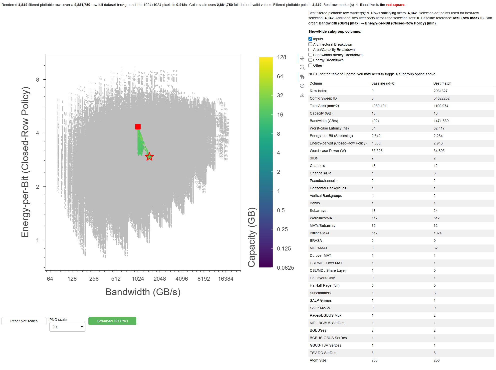

# DreamRAM
## Introduction
DreamRAM is a configurable modeling and design space exploration tool for custom 3D die-stacked DRAM architectures based on HBMs. DreamRAM analytically models bandwidth, capacity, energy, latency, and area while exposing fine-grained design customization parameters across the MAT, subarray, bank, and stack levels of DRAM, including extensions of half page, subchannel, and subarray parallelism proposals from literature, to open a large and previously unexplored design space of 3 million 3D-stacked DRAM configurations. DreamRAM analytically models wire pitch, width, length, capacitance, and scaling parameters to capture the performance tradeoffs of physical layout and routing design choices. We hope that DreamRAM will enable your application to match with the memory system of its dreams. 

![A diagram of the Dream RAM framework, showing the input parameters; the DreamRAM submodule flow; and outputs. The input parameters are listed, and fall into the stack-level, bank-level, subarray-level, or MAT-level, and include proposals from literature for half pages, subchannels, and subarray-level parallelism. The submodule flow first starts the architecture sweep and calculates the technology node scaling, then does the following: floorplanning (which gives capacity), routing and I/O (which gives area), core frequency estimation (which gives bandwidth), timing calculation (which gives latency/timing), and energy calculation.The major outputs are capacity, area, bandwidth, latency, and energy, with further breakdowns of each.](.images/dreamram-flow.png)

DreamRAM is being presented at DATE 2026. Until the conference proceedings, see the preprint at [https://arxiv.org/abs/2512.12106](https://arxiv.org/abs/2512.12106). Many updates have been made since the DATE camera-ready paper, which are pushed here to the main branch. To view the DATE 2026 version of the simulator, check out the DATE2026 branch. 

**Updates since the DATE 2026 version include**: 
- **Additional timing parameters** (tRCDWR, tRAS, tRC, tRRDS, tRRDL, tFAW, tRTP, tWR, PERI_tCK) aligned to JEDEC HBM3 values
- **Finer-grained signal wire counting** for command and clock signals
- **Additional MAT-level routing schemes**, now with both datalines and column select lines over the MAT
- **The DreamRAM Design Space Exploration and Visualization Tool**, enabling live and arbitrary filtering, sorting, and Pareto-drawing over 3 million design points and the ability to compare the best configurations
- **More in-depth design space exploration** of application case studies and insights into how changes to input parameters across different levels of the DRAM influence DRAM metrics

Here are a couple sample views of the full DreamRAM design space, colored by the design space tiers as specified in the publication:


## Usage
Here is the directory structure:
```
DreamRAM/
├── configs/              # Four input files:
│   ├── mem/
│   │   ├── baseline/     #   (1) Baseline memory configuration (default: hbm3_baseline.json)
│   │   ├── sweep/        #   (2) Memory sweep setup (default: hbm_sweep_default.json, uses hbm3_baseline.json)
│   └── tech/            
│       ├── baseline/     #   (3) Technology baseline (default: 2ynm_baseline.json)
│       ├── scaled/       #   (4) Scaled technology node (default: 16nm_scaled.json, uses 2ynm_baseline.json)
├── data/                 # Stores CSV files of generated datasets; appears once data is generated
├── plot_configs/         # Plot-related supporting files
│   ├── presets/          # Example plotting configurations for dreamram_explorer.py's JSON textbox input
│   └── ...               # Miscellaneous supporting files for dreamram_explorer.py
│
├── dreamram_explorer.py  # DreamRAM design space explorer and visualizer
├── dreamram.py           # DreamRAM main. Handles the sweep and calls parse.py, hbm.py, tech.py
├── hbm.py                # Functions to calculate outputs for one DRAM configuration
├── parse.py              # Parses input JSONs
├── README.md             
├── requirements.txt      
├── tech.py               # Functions related to the technology node and wire scaling
└── tier_generator.py     # (optional) Adds the design space tiers to the dataset
```

### Default Run
TLDR, to run the default sweep and start the design space explorer:
```
python3 dreamram.py
python3 tier_generator.py hbm_sweep_default
python3 dreamram_explorer.py data/hbm_sweep_default/hbm3_hbm_sweep_default_user.csv
```
The data is saved to `data/hbm_sweep_default`. NOTE: the default sweep (`hbm_sweep_default`) has nearly 3 million datapoints. It may take several hours and around 2 GB of storage. Do not be scared by the huge number of raw sweep points; a large majority are filtered out immediately (e.g., die area is too large, atom size cannot be met, etc.). 

### Running Custom Configurations on DreamRAM
DreamRAM's data is generated by `dreamram.py`. To change memory sweep, technology config, or the output file name:
```
python3 dreamram.py [-m MEMORY_SWEEP] [-t TECH_SCALED_CONFIG] [-o OUTPUT_LABEL]
```
This will save the data to `data/OUTPUT_LABEL` instead. To change the memory baseline used with a sweep, modify the memory baseline referenced in the memory sweep file in `configs/mem/sweep/`. Similarly, to change the technology baseline, modify the baseline tech file referenced in the scaled tech file in `configs/tech/scaled/`. 

To add the design space tiers, as specified in the publication:
```
python3 tier_generator.py OUTPUT_LABEL
```

### Design Space Explorer and Visualizer
After generating the data, the 
```
python3 dreamram_explorer.py /path/to/data/csv
```

#### Usage (Manual)
The DreamRAM Explorer allows you to specify the following inputs for the visualization: 
1. **Axes:** Use the dropdown menus at the top of the page to specify which input/output/metric to use for the x, y, and color axes. 
2. **Paretos:** The checkboxes below them allow you to toggle the following: (1) constrain the best-config stars must be on the pareto in x and y, (2) draw multiple paretos if there are few discrete values along the color axis, e.g. 5 design space tiers, or 3 values of an input variable, (3) show/hide the best-config stars.  
3. **Filters:** Use the "Add filter" button and the dropdowns/textboxes to specify limits on any arbitrary input/output/metric. 
4. **Best Config Sorting:** Change the sorting order for choosing the best-config stars. 
After changing the inputs manually, press "Update plot" to generate the visualization from these manual inputs. The best configs determined by the filters, paretos, and sorting are displayed in the chart in the bottom right, along with the baseline configuration for comparison. If multiple paretos are drawn, a best configuration is picked for each pareto and also displayed in the table. The checkboxes above the chart allow you to show/hide groups of inputs/outputs. 

#### Load a Preset Input Config from JSON
The DreamRAM Explorer can load/store the input above as a JSON file. `/plot_configs/presets` contains several example JSON inputs. To load a preset JSON file, paste it into the textbox in the top right and click "Load JSON". This updates all the inputs. Also note that any manual changes to the inputs are updated live in the textbox JSON, so you can easily save your current configuration by copying the JSON text. 

## Citation
DreamRAM has been accepted to DATE 2026. The DATE 2026 citation will be posted after the conference. In the meantime, you can find our paper at [https://arxiv.org/abs/2512.12106](https://arxiv.org/abs/2512.12106)

## Authors
Victor Cai, Jennifer Zhou, Haebin Do, David Brooks, and Gu-Yeon Wei

Harvard University, 2025

Please direct further inquiries to victorcai@college.harvard.edu